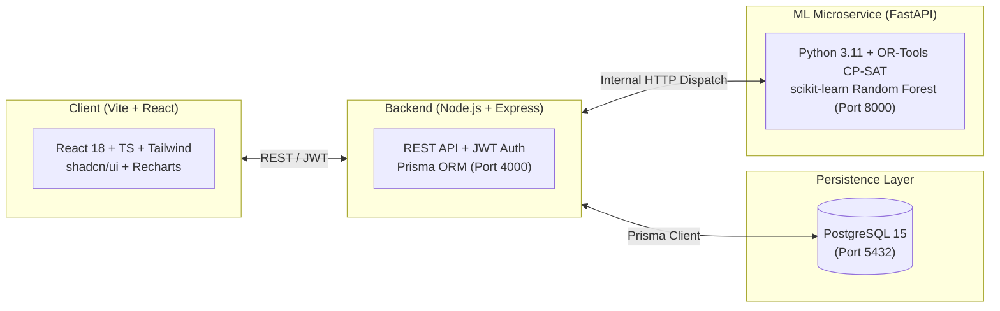

# College Timetable & Productivity Intelligence System (CMS)

A full-stack, enterprise-grade academic scheduling platform designed to handle **dynamic monthly calendar exceptions**, **equitable faculty workload distribution**, **predictive attendance optimization**, and **multi-signal lecture productivity measurement**.

---

## 🌟 Key Capabilities

- 📅 **Dynamic Monthly Timetables:** Generates monthly schedules based on a recurring semester template with automatic masking of holidays, university festivals, and exam periods.
- ⚖️ **Faculty Equity & Anti-Burnout Engine:** Rates time slots by desirability ($1.0 - 5.0$) and applies mathematical optimization (Gini coefficient minimization) to prevent the same teachers from being penalized with late-afternoon "ghost slots".
- 🤖 **ML-Powered Attendance Predictor:** Uses a trained Random Forest model to forecast attendance probabilities across slots, scheduling foundational courses when student focus and attendance are highest.
- 🧩 **Zero-Conflict Solver:** Uses **Google OR-Tools CP-SAT** to enforce inviolable hard constraints (no room, teacher, or batch collisions) and optimize soft constraints in seconds.
- 📊 **Multi-Signal Lecture Productivity:** Scores lecture effectiveness across four dimensions: Verified Attendance ($40\%$), Live In-Class Polls ($30\%$), Formative Quizzes ($20\%$), and Student Feedback ($10\%$).
- 📱 **Dynamic QR Code Check-in:** Time-rotating QR codes (refreshing every 15s) with geo-fencing and anti-proxy protection for rapid student attendance.
- 📈 **Institutional Intelligence Dashboards:** Tailored analytics for Administrators, Department Chairs, Teachers, and Students using Recharts.

---

## 🏛️ System Architecture & Tech Stack



| Layer | Technologies Used |
| :--- | :--- |
| **Frontend** | React 18, TypeScript, Vite, Tailwind CSS, shadcn/ui, TanStack Query v5, Recharts, Lucide Icons |
| **Backend** | Node.js, Express, TypeScript, Prisma ORM, PostgreSQL 15, JWT, Zod, Helmet, bcryptjs |
| **ML & Solver** | Python 3.11, FastAPI, Google OR-Tools (CP-SAT), scikit-learn, pandas, numpy, joblib |
| **DevOps** | Docker, Docker Compose, Nginx, PostgreSQL Alpine |

---

## 🚀 Quick Start

### Option 1: Docker Compose (Recommended)

Start the entire ecosystem (Client, Server, ML Service, PostgreSQL) with a single command:

```bash
# 1. Copy environment template
cp .env.example .env

# 2. Build and start containers
docker-compose up --build
```

Access the services:
- **Web App:** [http://localhost:5173](http://localhost:5173)
- **Backend API:** [http://localhost:4000/api](http://localhost:4000/api)
- **ML Service OpenAPI Docs:** [http://localhost:8000/docs](http://localhost:8000/docs)
- **PostgreSQL Database:** `localhost:5432`

### Option 2: Manual Local Development

For step-by-step local installation on Windows, Linux, or macOS, see [SETUP.md](file:///e:/xampp/htdocs/img/CMS/documentation/SETUP.md).

---

## 📚 Complete Documentation Suite

All system documentation is categorized and maintained in the root and `/documentation` directories:

| Document | Description |
| :--- | :--- |
| 📖 [**user_guide.md**](file:///e:/xampp/htdocs/img/CMS/user_guide.md) | **Must-read user guide** explaining how the system works in plain language, day-to-day scenarios, and troubleshooting. |
| 🏗️ [**documentation/ARCHITECTURE.md**](file:///e:/xampp/htdocs/img/CMS/documentation/ARCHITECTURE.md) | High-level system design, subsystem breakdown, sequence diagrams, container topology, and data flows. |
| 🗺️ [**documentation/PHASES.md**](file:///e:/xampp/htdocs/img/CMS/documentation/PHASES.md) | Complete 8-phase implementation roadmap (Phase 0 to 7) with tasks, milestones, and deliverables. |
| 🗄️ [**documentation/DATABASE.md**](file:///e:/xampp/htdocs/img/CMS/documentation/DATABASE.md) | Complete Prisma schema (`schema.prisma`), Entity-Relationship Diagram (ERD), model relations, and indices. |
| 🔌 [**documentation/API.md**](file:///e:/xampp/htdocs/img/CMS/documentation/API.md) | Exhaustive REST API specification: Auth, CRUD, Timetable Generation, Attendance, Feedback, and Analytics. |
| 🧠 [**documentation/ML_SERVICE.md**](file:///e:/xampp/htdocs/img/CMS/documentation/ML_SERVICE.md) | OR-Tools CP-SAT mathematical formulation, Random Forest attendance prediction, and Gini fairness index. |
| ⚙️ [**documentation/SETUP.md**](file:///e:/xampp/htdocs/img/CMS/documentation/SETUP.md) | Detailed installation steps for Docker and manual local environments, environment variables, and seeding. |
| 🤖 [**documentation/AI_DEV_GUIDE.md**](file:///e:/xampp/htdocs/img/CMS/documentation/AI_DEV_GUIDE.md) | **Master Blueprint for AI Agents** (Claude, Antigravity) with file tree targets, coding rules, and build sequence. |

---

## 🔑 Pre-Seeded Default Accounts

When initialized with `npx prisma db seed`, the following test credentials are ready for use:

| Role | Email | Password | Primary Functions |
| :--- | :--- | :--- | :--- |
| **Admin** | `admin@college.edu` | `AdminPass123!` | Timetable solver generation, manual overrides, publishing, resource management |
| **Teacher** | `turing@college.edu` | `TeacherPass123!` | View personal schedule, launch attendance QR code, launch lecture polls |
| **Teacher** | `hopper@college.edu` | `TeacherPass123!` | View personal schedule, check-in roll call, view lecture productivity scores |
| **Student** | `student1@college.edu` | `StudentPass123!` | View batch schedule, scan QR check-in, submit formative lecture feedback |

---

## 📁 Repository Structure

```
college-timetable/
├── docker-compose.yml             # Multi-service container orchestration
├── .env.example                   # Master environment variables template
├── README.md                      # Project overview & documentation index
├── user_guide.md                  # Comprehensive user and administrator guide
├── documentation/                 # Technical documentation & engineering specs
│   ├── ARCHITECTURE.md
│   ├── PHASES.md
│   ├── DATABASE.md
│   ├── API.md
│   ├── ML_SERVICE.md
│   ├── SETUP.md
│   └── AI_DEV_GUIDE.md
├── client/                        # Vite + React 18 + TypeScript frontend
├── server/                        # Node.js + Express + TypeScript + Prisma backend
└── ml-service/                    # Python 3.11 + FastAPI + OR-Tools + scikit-learn
```

---

