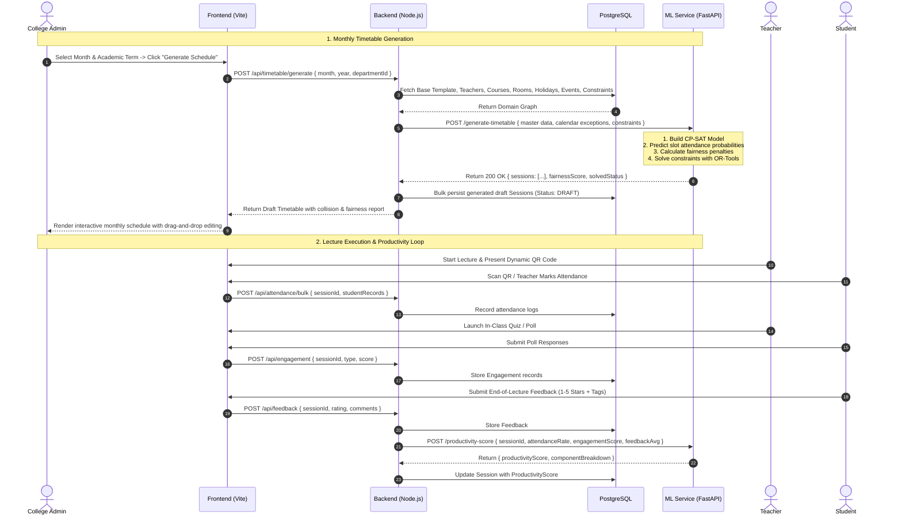
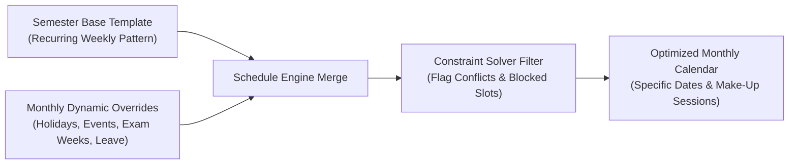
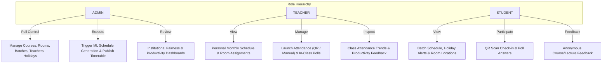
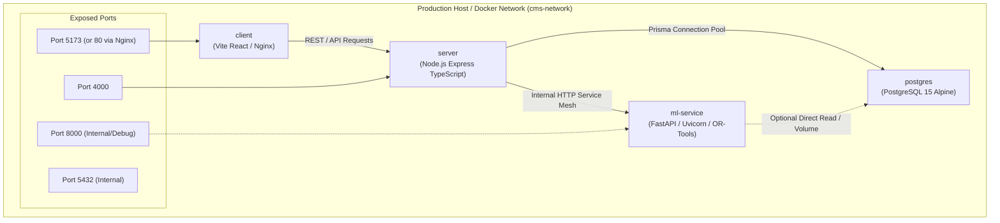

# System Architecture: College Scheduling & Productivity Intelligence System

## 1. Executive Summary & Core Philosophy

The **College Scheduling & Productivity Intelligence System (CMS)** is a multi-tier, modular enterprise academic management platform. It solves four critical pain points in higher education institution administration:

1. **Dynamic Monthly Schedules vs. Static Semesters:** Rather than relying on rigid, semester-long timetables or reinventing the wheel each month, the system operates on a **Semester Base Template + Monthly Dynamic Override** model that automatically incorporates holidays, sports meets, cultural fests, examinations, and faculty leaves.
2. **Teacher Workload Equity & Slot Fairness:** Prevents faculty burnout and disenfranchisement caused by "ghost slots" (late afternoon or early morning lectures where attendance crashes). The system quantifies slot desirability and uses mathematical optimization to balance undesirable slots equitably across teachers.
3. **Multi-Signal Lecture Productivity:** Shifts the focus from mere scheduled hours to actual educational impact by computing composite productivity scores combining verified attendance, real-time in-class engagement, formative learning outcomes, and student sentiment.
4. **Predictive Attendance Optimization:** Integrates historical attendance patterns (by time slot, day, course difficulty, batch, and instructor) directly into the scheduling objective function to maximize student presence and minimize absentee surges.

---

## 2. High-Level Architecture Diagram

```mermaid
graph TD
    subgraph ClientLayer ["Client Layer (Frontend)"]
        UI["Vite + React 18 + TypeScript"]
        Tailwind["Tailwind CSS + shadcn/ui"]
        Charts["Recharts Analytics"]
        DnD["Drag-and-Drop Timetable Canvas"]
    end

    subgraph APILayer ["Application Gateway & API (Backend)"]
        Server["Node.js / Express / TypeScript"]
        Auth["JWT Auth (Access + Refresh Tokens) & RBAC"]
        Prisma["Prisma ORM Client"]
        Proxy["ML Service Reverse Proxy & Dispatcher"]
    end

    subgraph MLLayer ["Optimization & Intelligence (ML Service)"]
        FastAPI["Python 3.11 / FastAPI (Async REST API)"]
        CPSAT["Google OR-Tools CP-SAT Solver"]
        RF["scikit-learn Random Forest (Attendance Predictor)"]
        Fairness["Fairness & Variance Balancing Engine"]
        Productivity["Composite Productivity Scorer"]
    end

    subgraph DataLayer ["Persistence Layer"]
        Postgres[(PostgreSQL 15 Database)]
        ModelStore[("joblib Model Store (.joblib)")]
    end

    UI -->|HTTP / REST (JWT)| Server
    Server -->|CRUD Operations| Prisma
    Prisma -->|TCP 5432| Postgres
    Server -->|Internal REST Call (Port 8000)| FastAPI
    FastAPI -->|Load/Save Artifacts| ModelStore
    FastAPI -->|Train / Infer| RF
    FastAPI -->|Solve Constraints| CPSAT
    FastAPI -->|Calculate Equity| Fairness
    FastAPI -->|Score Sessions| Productivity
```

---

## 3. Subsystem Breakdown

### 3.1 Client Layer (Frontend)
- **Framework:** React 18 with TypeScript powered by Vite for rapid HMR and optimized production bundles.
- **Styling & UI Components:** Tailwind CSS with accessible, modular primitives from `shadcn/ui` (Radix UI base) and Lucide React icons.
- **State Management & Server Cache:** `@tanstack/react-query` (TanStack Query v5) for optimistic updates, server state synchronization, query caching, and automatic refetching.
- **Form Architecture:** `react-hook-form` coupled with `zod` schema resolvers for strict type-safe client-side input validation.
- **Interactive Timetable Canvas:** Drag-and-drop calendar matrix (weekly and monthly grid views) supporting direct administrative overrides, collision highlighting, and slot desirability indicators.
- **Analytics & Visualizations:** `recharts` for multi-dimensional data display: attendance trends, faculty fairness distribution, room utilization heatmaps, and lecture productivity curves.

### 3.2 Application Gateway & Business Logic Layer (Backend)
- **Runtime & Language:** Node.js (v18+) with Express and TypeScript in strict mode.
- **Architecture:** Controller-Service-Repository pattern with explicit dependency separation:
  - `controllers/`: HTTP payload handling, query parameter parsing, and response formatting.
  - `services/`: Business rules, permission checks, scheduling validation, and external service calls.
  - `routes/`: Express router definitions with middleware chains.
  - `middlewares/`: JWT authentication verification, Role-Based Access Control (`ADMIN`, `TEACHER`, `STUDENT`), request validation using Zod, rate limiting, and global error handling.
- **ORM & Data Mapping:** Prisma ORM connected to PostgreSQL 15, handling database migrations, type generation, connection pooling, and relational seeding.
- **Security Primitives:**
  - `bcryptjs` for salted password hashing.
  - Dual JWT token strategy: short-lived Access Tokens (15 min) in authorization headers + secure HTTP-only Refresh Tokens (7 days).
  - `helmet` for security headers, CORS policy enforcement, and `express-rate-limit` for DDoS protection.

### 3.3 ML & Optimization Service (Python FastAPI)
- **Runtime:** Python 3.11 with FastAPI and Uvicorn running an asynchronous REST API on port `8000`.
- **Constraint Programming Engine:** Google OR-Tools `CP-SAT` (Constraint Programming - Satisfiability). CP-SAT maps academic rules into Boolean variables, integer domains, hard constraint clauses, and an integer objective function.
- **Attendance Prediction Engine:** `scikit-learn` ensemble model (Random Forest Regressor / Classifier) trained on historical attendance records.
- **Fairness Calculation Module:** Evaluates Gini coefficients and slot variance across faculty to penalize schedules that disproportionately allocate undesirable slots to specific instructors.
- **Productivity Scoring Module:** Standardizes and aggregates heterogeneous signals (attendance, polls, quizzes, exit tickets, and student feedback) into calibrated scores per lecture.

### 3.4 Persistence Layer
- **PostgreSQL 15:** Relational database storing all normalized master entities, transactional timetable sessions, attendance logs, engagement metrics, feedback, and constraints.
- **Model Storage:** Local disk / volume (`/models/attendance_model.joblib`) storing serialized scikit-learn models and feature transformer metadata.

---

## 4. End-to-End Data Flow & Interaction Lifecycles



---

## 5. Scheduling Engine Architecture: Template + Monthly Overrides

A major innovation of this architecture is avoiding full random regeneration every month:



1. **Semester Base Pattern:** Defines baseline curricular requirements (e.g., Computer Science Batch A requires 4 hours of Database Systems, 2 hours of Data Structures Lab).
2. **Monthly Date Masking:** For a target month (e.g., October 2026), the engine generates all calendar dates, maps weekday slots, and masks slots falling on declared `Holiday` or `Event` dates.
3. **Make-up / Compensation Slots:** If a holiday causes a course to fall below its statutory monthly contact hours, the solver automatically identifies high-attendance available open slots to insert make-up sessions without overloading students.

---

## 6. Teacher Equity & Slot Desirability Architecture

### 6.1 Slot Desirability Scoring Matrix
Each `TimeSlot` is assigned a desirability coefficient $D(s) \in [1, 5]$ based on historical alertness and attendance:

| Time Slot | Typical Window | Desirability Score $D(s)$ | Classification |
| :--- | :--- | :---: | :--- |
| **P1** | 08:30 - 09:30 | 2.0 | Undesirable (Early commuter drop) |
| **P2** | 09:30 - 10:30 | 5.0 | Prime Slot (Peak focus & attendance) |
| **P3** | 10:45 - 11:45 | 5.0 | Prime Slot |
| **P4** | 11:45 - 12:45 | 4.0 | Good Slot |
| **LUNCH**| 12:45 - 01:45 | 0.0 | Hard Reserved Break |
| **P5** | 01:45 - 02:45 | 3.5 | Post-lunch moderate dip |
| **P6** | 02:45 - 03:45 | 3.0 | Afternoon Slot |
| **P7** | 03:45 - 04:45 | 1.5 | Highly Undesirable (End-of-day drop) |

### 6.2 Mathematical Fairness Metric
For each teacher $t$, let $U_t$ be the total count of undesirable slots ($D(s) \le 2.0$) assigned in the monthly schedule:
$$\bar{U} = \frac{1}{|T|} \sum_{t \in T} U_t$$
The scheduling objective penalizes the variance of undesirable slot distribution:
$$\text{Penalty}_{\text{fairness}} = W_{\text{fairness}} \times \sum_{t \in T} (U_t - \bar{U})^2$$
Furthermore, the system tracks historical undesirable slot assignments across consecutive months, ensuring faculty who had end-of-day slots in Month $M$ are prioritized for prime morning slots in Month $M+1$.

---

## 7. Security, Roles & Access Control

The platform enforces three strict organizational tiers:



---

## 8. Deployment Architecture (Docker Topology)


