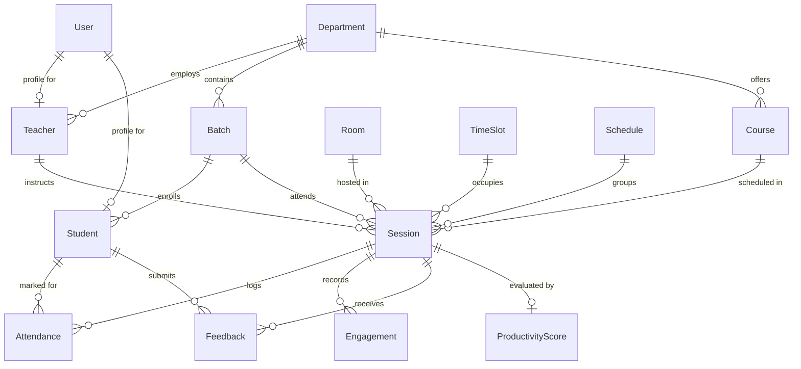

# Database Architecture & Prisma Schema Reference

This document provides the definitive data model, Entity-Relationship Diagram (ERD), table specifications, indexing strategy, and seeding guidelines for the **College Scheduling & Productivity Intelligence System**.

---

## 1. Entity-Relationship Diagram (ERD)



---

## 2. Complete Prisma Schema (`prisma/schema.prisma`)

```prisma
datasource db {
  provider = "postgresql"
  url      = env("DATABASE_URL")
}

generator client {
  provider = "prisma-client-js"
}

// ----------------------------------------------------
// ENUMS
// ----------------------------------------------------

enum Role {
  ADMIN
  TEACHER
  STUDENT
}

enum CourseType {
  THEORY
  LAB
  TUTORIAL
  SEMINAR
}

enum RoomType {
  LECTURE_HALL
  COMPUTER_LAB
  SCIENCE_LAB
  AUDITORIUM
  SEMINAR_ROOM
}

enum SessionStatus {
  SCHEDULED
  COMPLETED
  CANCELLED_HOLIDAY
  CANCELLED_EVENT
  RESCHEDULED
}

enum AttendanceStatus {
  PRESENT
  ABSENT
  LATE
  EXCUSED
}

enum EngagementType {
  POLL
  QUIZ
  QUESTION
  INTERACTIVE_EXERCISE
}

enum ConstraintType {
  HARD
  SOFT
}

enum ScheduleStatus {
  DRAFT
  PUBLISHED
  ARCHIVED
}

// ----------------------------------------------------
// USER & IDENTITY MODELS
// ----------------------------------------------------

model User {
  id           String    @id @default(uuid())
  email        String    @unique
  passwordHash String
  name         String
  role         Role      @default(STUDENT)
  avatarUrl    String?
  createdAt    DateTime  @default(now())
  updatedAt    DateTime  @updatedAt

  teacherProfile Teacher?
  studentProfile Student?

  @@index([email])
}

model Department {
  id        String    @id @default(uuid())
  name      String    @unique
  code      String    @unique
  createdAt DateTime  @default(now())
  updatedAt DateTime  @updatedAt

  teachers  Teacher[]
  batches   Batch[]
  courses   Course[]
  rooms     Room[]
}

model Teacher {
  id           String      @id @default(uuid())
  userId       String      @unique
  departmentId String
  designation  String?     // e.g. "Associate Professor"
  maxWeeklyLoad Int        @default(18) // Max contact hours allowed
  preferences  Json?       // e.g. {"preferredDays": [1,2,3], "avoidEarlySlots": true}
  createdAt    DateTime    @default(now())
  updatedAt    DateTime    @updatedAt

  user         User        @relation(fields: [userId], references: [id], onDelete: Cascade)
  department   Department  @relation(fields: [departmentId], references: [id])
  sessions     Session[]

  @@index([departmentId])
}

model Batch {
  id           String     @id @default(uuid())
  name         String     // e.g. "CS-2024-Semester-4-A"
  departmentId String
  semester     Int        @default(1)
  size         Int        @default(60) // Student headcount
  createdAt    DateTime   @default(now())
  updatedAt    DateTime   @updatedAt

  department   Department @relation(fields: [departmentId], references: [id])
  students     Student[]
  sessions     Session[]

  @@index([departmentId])
}

model Student {
  id         String       @id @default(uuid())
  userId     String       @unique
  batchId    String
  rollNumber String       @unique
  createdAt  DateTime     @default(now())
  updatedAt  DateTime     @updatedAt

  user       User         @relation(fields: [userId], references: [id], onDelete: Cascade)
  batch      Batch        @relation(fields: [batchId], references: [id])
  attendances Attendance[]
  feedbacks  Feedback[]

  @@index([batchId])
}

// ----------------------------------------------------
// INFRASTRUCTURE & ACADEMIC OFFERINGS
// ----------------------------------------------------

model Course {
  id           String      @id @default(uuid())
  name         String
  code         String      @unique // e.g. "CS401"
  credits      Int         @default(3)
  weeklyHours  Int         @default(4)
  type         CourseType  @default(THEORY)
  departmentId String
  createdAt    DateTime    @default(now())
  updatedAt    DateTime    @updatedAt

  department   Department  @relation(fields: [departmentId], references: [id])
  sessions     Session[]

  @@index([departmentId])
}

model Room {
  id           String      @id @default(uuid())
  name         String      @unique // e.g. "LH-101", "Lab-3"
  capacity     Int         @default(60)
  type         RoomType    @default(LECTURE_HALL)
  departmentId String?     // Optional dedicated department room
  equipment    Json?       // e.g. {"hasProjector": true, "workstations": 60}
  createdAt    DateTime    @default(now())
  updatedAt    DateTime    @updatedAt

  department   Department? @relation(fields: [departmentId], references: [id])
  sessions     Session[]
}

model TimeSlot {
  id                 String    @id @default(uuid())
  dayOfWeek          Int       // 1 = Monday, 2 = Tuesday, ..., 6 = Saturday
  slotNumber         Int       // 1 to 7 (period index)
  startTime          String    // e.g. "09:30" (24-hour format)
  endTime            String    // e.g. "10:30"
  isBreak            Boolean   @default(false) // e.g. Lunch break
  desirabilityScore  Float     @default(3.0)   // 1.0 (least desirable) to 5.0 (prime)
  createdAt          DateTime  @default(now())
  updatedAt          DateTime  @updatedAt

  sessions           Session[]

  @@unique([dayOfWeek, slotNumber])
  @@index([dayOfWeek])
}

// ----------------------------------------------------
// CALENDAR, HOLIDAYS & EVENTS
// ----------------------------------------------------

model AcademicCalendar {
  id            String    @id @default(uuid())
  academicYear  String    // e.g. "2026-2027"
  semester      Int       // 1, 2, etc.
  startDate     DateTime
  endDate       DateTime
  isActive      Boolean   @default(true)
  createdAt     DateTime  @default(now())
  updatedAt     DateTime  @updatedAt
}

model Holiday {
  id          String    @id @default(uuid())
  name        String    // e.g. "Independence Day", "Diwali Break"
  date        DateTime  // Day of the holiday
  description String?
  isGazetted  Boolean   @default(true)
  createdAt   DateTime  @default(now())

  @@unique([date])
  @@index([date])
}

model Event {
  id               String    @id @default(uuid())
  name             String    // e.g. "Annual Tech Fest", "Midterm Exams"
  startDate        DateTime
  endDate          DateTime
  affectedBatches  Json?     // List of batch IDs, or null if campus-wide
  blocksSchedule   Boolean   @default(true)
  createdAt        DateTime  @default(now())

  @@index([startDate, endDate])
}

// ----------------------------------------------------
// SCHEDULES & SESSIONS
// ----------------------------------------------------

model Schedule {
  id          String         @id @default(uuid())
  name        String         // e.g. "Computer Science - October 2026"
  month       Int            // 1 to 12
  year        Int            // 2026
  version     Int            @default(1)
  status      ScheduleStatus @default(DRAFT)
  fairnessGini Float?        // Calculated Gini coefficient for teacher slot distribution
  createdAt   DateTime       @default(now())
  updatedAt   DateTime       @updatedAt

  sessions    Session[]

  @@unique([month, year, version])
  @@index([month, year])
}

model Session {
  id          String         @id @default(uuid())
  scheduleId  String
  courseId    String
  teacherId   String
  batchId     String
  roomId      String
  timeSlotId  String
  date        DateTime       // Specific calendar date (e.g. 2026-10-12)
  status      SessionStatus  @default(SCHEDULED)
  createdAt   DateTime       @default(now())
  updatedAt   DateTime       @updatedAt

  schedule    Schedule       @relation(fields: [scheduleId], references: [id], onDelete: Cascade)
  course      Course         @relation(fields: [courseId], references: [id])
  teacher     Teacher        @relation(fields: [teacherId], references: [id])
  batch       Batch          @relation(fields: [batchId], references: [id])
  room        Room           @relation(fields: [roomId], references: [id])
  timeSlot    TimeSlot       @relation(fields: [timeSlotId], references: [id])

  attendances Attendance[]
  engagements Engagement[]
  feedbacks   Feedback[]
  productivity ProductivityScore?

  @@index([date, roomId])
  @@index([date, teacherId])
  @@index([date, batchId])
  @@index([scheduleId])
}

// ----------------------------------------------------
// ATTENDANCE, ENGAGEMENT & PRODUCTIVITY
// ----------------------------------------------------

model Attendance {
  id         String           @id @default(uuid())
  sessionId  String
  studentId  String
  status     AttendanceStatus @default(ABSENT)
  markedVia  String?          // "QR_SCAN", "TEACHER_MANUAL", "BIOMETRIC"
  markedAt   DateTime         @default(now())

  session    Session          @relation(fields: [sessionId], references: [id], onDelete: Cascade)
  student    Student          @relation(fields: [studentId], references: [id])

  @@unique([sessionId, studentId])
  @@index([studentId])
}

model Engagement {
  id          String         @id @default(uuid())
  sessionId   String
  type        EngagementType @default(POLL)
  totalPrompt String?        // Question / poll title
  score       Float          // Normalized score 0.0 - 1.0 (or % participating)
  createdAt   DateTime       @default(now())

  session     Session        @relation(fields: [sessionId], references: [id], onDelete: Cascade)

  @@index([sessionId])
}

model Feedback {
  id         String    @id @default(uuid())
  sessionId  String
  studentId  String
  rating     Int       // 1 to 5 stars
  tags       Json?     // Array of tags: ["clear_pacing", "too_fast", "interactive"]
  comment    String?
  createdAt  DateTime  @default(now())

  session    Session   @relation(fields: [sessionId], references: [id], onDelete: Cascade)
  student    Student   @relation(fields: [studentId], references: [id])

  @@unique([sessionId, studentId])
  @@index([sessionId])
}

model ProductivityScore {
  id               String   @id @default(uuid())
  sessionId        String   @unique
  attendanceRate   Float    // % students present
  engagementScore  Float    // Average score from polls/quizzes
  learningScore    Float    // Score from formative exit checks
  feedbackScore    Float    // Average student rating normalized (0-1)
  compositeScore   Float    // Weighted final composite score (0-100)
  computedAt       DateTime @default(now())

  session          Session  @relation(fields: [sessionId], references: [id], onDelete: Cascade)
}

// ----------------------------------------------------
// SOLVER CONSTRAINTS SPECIFICATION
// ----------------------------------------------------

model Constraint {
  id          String         @id @default(uuid())
  name        String         @unique // e.g. "NO_TEACHER_DOUBLE_BOOKING"
  type        ConstraintType @default(HARD)
  description String?
  weight      Float          @default(1.0) // Soft constraint weight multiplier
  parameters  Json?          // Dynamic config payload
  isActive    Boolean        @default(true)
  createdAt   DateTime       @default(now())
  updatedAt   DateTime       @updatedAt
}
```

---

## 3. High-Performance Indexing Strategy

To support fast timetable grid rendering, conflict detection, and real-time attendance logging, the following multi-column indices are enforced:

1. **`Session (date, roomId)`**: Ensures instantaneous lookups to detect if classroom $R$ is occupied on date $D$.
2. **`Session (date, teacherId)`**: Accelerates personal timetable retrieval and prevents faculty collision.
3. **`Session (date, batchId)`**: Guarantees no student cohort has overlapping lectures.
4. **`Attendance (sessionId, studentId)`**: Unique compound index preventing duplicate roll calls while keeping per-student historical aggregation fast.
5. **`Feedback (sessionId, studentId)`**: Enforces single submission per student per session while preserving anonymity when queried by session.

---

## 4. Migration & Seeding Workflows

### 4.1 Running Migrations
```bash
# In the /server directory:
npx prisma migrate dev --name init
npx prisma generate
```

### 4.2 Database Seeding Plan
The `prisma/seed.ts` script populates a realistic academic institution dataset:
- **1 Admin user:** `admin@college.edu`
- **1 Department:** `Department of Computer Science & Engineering (CSE)`
- **8 Teachers:** Across disciplines (Algorithms, Databases, Networks, AI/ML, Web Systems) with varied weekly load limits.
- **4 Batches:** CS-Year-2 (Batches A & B) and CS-Year-3 (Batches A & B), total 160 students.
- **12 Courses:** Mix of Theory (3-4 credits) and Labs (2 credits).
- **8 Rooms:** 4 Lecture Halls (capacity 80), 2 Computer Labs (capacity 60), 2 Seminar Rooms (capacity 40).
- **35 TimeSlots:** Monday through Friday, 7 slots per day (Periods 1-7 including lunch break at Period 4).
- **Historical Attendance Data:** 200 past lecture sessions populated with varying attendance rates and engagement scores to prime the ML model.

Execute the seed script via:
```bash
npm run seed
# or
npx prisma db seed
```
