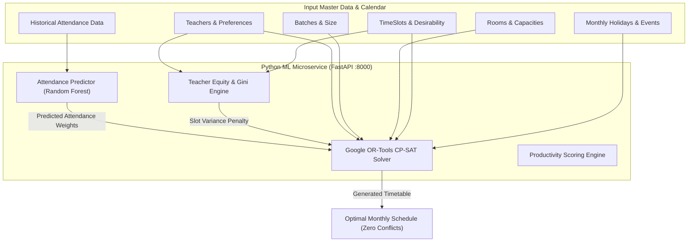

# Machine Learning Service & Optimization Architecture

This document provides a deep technical dive into the algorithms, mathematical formulations, feature pipelines, and endpoints powering the **Python FastAPI ML Service** (`ml-service`).

---

## 1. Overview of the Intelligence Stack

The ML service is an asynchronous Python 3.11 FastAPI microservice designed for:
1. **Combinatorial Timetable Optimization:** Using **Google OR-Tools CP-SAT** to solve hard institutional rules while optimizing a multi-objective cost function.
2. **Predictive Student Attendance:** Using a **scikit-learn Random Forest Regressor** to predict expected attendance rates for candidate class sessions.
3. **Teacher Workload & Slot Equity Balancing:** Computing Gini coefficients and slot variance penalties to eliminate unfair faculty assignment to late/undesirable periods.
4. **Lecture Productivity Scoring:** Aggregating multi-source educational signals (attendance, polls, exit tickets, ratings) into standardized productivity indices.



---

## 2. Constraint Programming Engine (OR-Tools CP-SAT)

The scheduling problem is modeled as a Constraint Satisfaction Problem (CSP) with an integer objective function.

### 2.1 Decision Variables
Let:
- $C$ = Set of course lecture assignments $(c)$
- $T$ = Set of teachers $(t)$
- $B$ = Set of student batches $(b)$
- $R$ = Set of available rooms $(r)$
- $S$ = Set of time slots $(s)$ within the scheduling window
- $D$ = Set of active calendar days $(d)$

For each course session $(c)$ requiring assignment to teacher $t(c)$, batch $b(c)$, on day $d$, room $r$, and slot $s$:
$$X_{c, r, d, s} \in \{0, 1\}$$
where $X_{c, r, d, s} = 1$ if course session $c$ is scheduled in room $r$ on day $d$ at time slot $s$; otherwise $0$.

---

### 2.2 Hard Constraints (Inviolable Rules)

1. **Course Weekly Hours Fulfilled:**
   Every course $c$ must be assigned exactly its required contact hours $H_c$:
   $$\sum_{r \in R} \sum_{d \in D} \sum_{s \in S} X_{c, r, d, s} = H_c, \quad \forall c \in C$$

2. **No Teacher Double-Booking:**
   A teacher $t$ cannot teach two classes simultaneously:
   $$\sum_{c \in C_t} \sum_{r \in R} X_{c, r, d, s} \le 1, \quad \forall t \in T, \forall d \in D, \forall s \in S$$
   where $C_t$ is the set of courses instructed by teacher $t$.

3. **No Room Collisions:**
   A room $r$ can host at most one class at any time:
   $$\sum_{c \in C} X_{c, r, d, s} \le 1, \quad \forall r \in R, \forall d \in D, \forall s \in S$$

4. **No Student Batch Overlaps:**
   A student batch $b$ cannot have two lectures in the same slot:
   $$\sum_{c \in C_b} \sum_{r \in R} X_{c, r, d, s} \le 1, \quad \forall b \in B, \forall d \in D, \forall s \in S$$
   where $C_b$ is the set of courses attended by batch $b$.

5. **Room Capacity & Type Matching:**
   A course $c$ with student headcount $\text{Size}(b_c)$ can only be assigned to room $r$ if:
   $$\text{Capacity}(r) \ge \text{Size}(b_c)$$
   and $\text{Type}(r) \equiv \text{Type}(c)$ (e.g. Lab courses can only be scheduled in `COMPUTER_LAB` or `SCIENCE_LAB`).

6. **Consecutive Lecture Cap for Teachers:**
   No teacher may be assigned more than $K_{\max} = 3$ consecutive periods without a rest gap.

7. **Institutional Lunch Break Reservation:**
   For all days $d$, the standard lunch slot $s_{\text{lunch}}$ is hard-reserved ($X_{c, r, d, s_{\text{lunch}}} = 0$ for all standard lectures).

8. **Holiday & Event Exclusion:**
   If day $d$ is a declared `Holiday` or `Event` affecting batch $b$, all slots on that date for batch $b$ are constrained to 0.

---

### 2.3 Soft Constraints & Multi-Objective Function

The objective is to maximize total institutional quality $Q$, defined as:

$$\max Q = W_{\text{att}} \cdot Q_{\text{attendance}} + W_{\text{pref}} \cdot Q_{\text{preference}} - W_{\text{fair}} \cdot \text{Penalty}_{\text{fairness}} - W_{\text{gap}} \cdot \text{Penalty}_{\text{student\_gaps}}$$

#### A. Predicted Attendance Component ($Q_{\text{attendance}}$)
Using the ML model to predict attendance probability $\hat{A}(c, d, s) \in [0, 1]$:
$$Q_{\text{attendance}} = \sum_{c, r, d, s} \left( \hat{A}(c, d, s) \times 100 \right) \cdot X_{c, r, d, s}$$

#### B. Teacher Preference Satisfaction ($Q_{\text{preference}}$)
Let $P(t, d, s) \in [1, 5]$ be teacher $t$'s stated preference for slot $s$ on day $d$:
$$Q_{\text{preference}} = \sum_{c \in C_t, r, d, s} P(t(c), d, s) \cdot X_{c, r, d, s}$$

#### C. Teacher Undesirable Slot Fairness Penalty ($\text{Penalty}_{\text{fairness}}$)
Let undesirable slots be slots where slot desirability $D(s) \le 2.0$ (e.g. 8:30 AM or 3:45 PM).
Let $U_t$ be the total undesirable slots allocated to teacher $t$:
$$U_t = \sum_{c \in C_t, r, d, s \in S_{\text{undesirable}}} X_{c, r, d, s}$$
The penalty penalizes deviation from the mean $\bar{U} = \frac{1}{|T|} \sum_{t} U_t$:
$$\text{Penalty}_{\text{fairness}} = \sum_{t \in T} (U_t - \bar{U})^2$$

#### D. Student Gap Minimization ($\text{Penalty}_{\text{student\_gaps}}$)
Penalizes schedules with "dead time" (isolated empty 1-hour holes between lectures) in a batch's daily timetable.

---

## 3. Attendance Prediction Model (`predictor.py`)

### 3.1 Motivation
Scheduling heavy or foundational courses (e.g., Mathematics, Database Theory) in slots where student attendance routinely plummets (e.g., Friday 4:00 PM) harms learning outcomes. The predictor forecasts attendance likelihood so the solver places high-priority courses in high-retention windows.

### 3.2 Feature Engineering
The model consumes tabular features for each prospective session:

| Feature Name | Type | Description |
| :--- | :--- | :--- |
| `day_of_week` | Integer (1–6) | Monday (1) to Saturday (6) |
| `slot_number` | Integer (1–7) | Period number |
| `is_first_slot` | Binary (0/1) | Whether slot starts before 9:00 AM |
| `is_last_slot` | Binary (0/1) | Whether slot is the final period of the day |
| `course_level` | Integer (1–4) | 1st, 2nd, 3rd, or 4th year course |
| `course_type` | Categorical | `THEORY`, `LAB`, `TUTORIAL` |
| `batch_size` | Integer | Number of enrolled students |
| `teacher_attendance_avg` | Float | Historical rolling average attendance for this instructor |
| `course_attendance_avg` | Float | Historical rolling average attendance for this subject |

### 3.3 Model Architecture & Training
- **Algorithm:** Random Forest Regressor (`n_estimators=150`, `max_depth=10`, `random_state=42`).
- **Target:** Attendance Percentage $A \in [0.0, 1.0]$.
- **Evaluation Metrics:** Mean Absolute Error (MAE $\le 0.04$), $R^2 \ge 0.82$.
- **Training Pipeline (`train_attendance_model.py`):**
  1. Pulls historical session records from PostgreSQL (or synthetic seed dataset).
  2. Applies `OneHotEncoder` on categorical features and `StandardScaler` on numerical features via `sklearn.compose.ColumnTransformer`.
  3. Fits the regressor and serializes pipeline via `joblib.dump(pipeline, "models/attendance_model.joblib")`.

---

## 4. Teacher Fairness & Workload Equity Engine (`fairness.py`)

### 4.1 The "Ghost Slot" Problem
In traditional college timetables, junior faculty or specific teachers are consistently scheduled during the final period of the day (e.g. 3:45–4:45 PM), where attendance drops from 85% to 45%. This leads to:
- Disproportionate teacher dissatisfaction.
- Lower syllabus completion rates.
- Skewed productivity scores for affected teachers.

### 4.2 Slot Desirability Matrix
Each time slot is mapped to a desirability index $D(s)$:
- $D(s) = 5.0$: Prime morning focus (9:30–12:30).
- $D(s) = 3.5$: Early afternoon (1:45–2:45).
- $D(s) = 2.0$: Early morning commuter arrival (8:30–9:30).
- $D(s) = 1.5$: Late afternoon fatigue slot (3:45–4:45).

### 4.3 Equity Metric: Gini Coefficient
The system calculates the Gini coefficient $G$ of undesirable slot allocations across faculty:
$$G = \frac{\sum_{i=1}^{n} \sum_{j=1}^{n} |U_i - U_j|}{2n \sum_{i=1}^{n} U_i}$$
- $G = 0.0$: Perfect equity (every teacher has identical count of undesirable slots).
- $G > 0.35$: Significant inequity (triggers administrative warning).
The solver ensures $G < 0.15$ in generated timetables.

---

## 5. Lecture Productivity Scoring Engine (`productivity.py`)

Rather than judging a lecture purely by whether students swiped their ID card, the system computes a multi-faceted **Productivity Score** $P \in [0, 100]$:

$$P = 100 \times \left( w_A \cdot S_A + w_E \cdot S_E + w_L \cdot S_L + w_F \cdot S_F \right)$$

### 5.1 Signal Components

1. **Attendance Score ($S_A \in [0, 1]$):**
   $$S_A = \frac{\text{Students Present}}{\text{Total Enrolled Batch Size}}$$
   *(Default Weight: $w_A = 0.40$)*

2. **In-Class Engagement ($S_E \in [0, 1]$):**
   Measures active participation in interactive polls, questions, or live discussions launched during the lecture:
   $$S_E = \frac{\text{Students Participating in Polls}}{\text{Students Present}}$$
   *(Default Weight: $w_E = 0.30$)*

3. **Formative Learning Outcome ($S_L \in [0, 1]$):**
   Evaluates 1-question exit ticket or comprehension quiz score:
   $$S_L = \text{Mean quiz accuracy score across respondents}$$
   *(Default Weight: $w_L = 0.20$)*

4. **Student Sentiment & Feedback ($S_F \in [0, 1]$):**
   Normalized student rating from post-lecture exit feedback (1–5 stars):
   $$S_F = \frac{\text{Average Star Rating} - 1}{4}$$
   *(Default Weight: $w_F = 0.10$)*

---

## 6. Directory Structure & Key Files

```
/ml-service
├── Dockerfile
├── requirements.txt
├── main.py                     # FastAPI application entrypoint & routing
├── scheduler.py                # CP-SAT constraint model definition & solver
├── predictor.py                # Attendance prediction inference pipeline
├── fairness.py                 # Gini coefficient & slot equity calculations
├── productivity.py             # Lecture productivity scoring engine
├── train_attendance_model.py   # Model training & serialization script
├── models/
│   └── attendance_model.joblib # Serialized trained scikit-learn model
└── tests/
    ├── test_scheduler.py       # Solvability & collision test suite
    └── test_predictor.py       # ML inference validation tests
```

---

## 7. Python Dependencies (`requirements.txt`)

```txt
fastapi>=0.110.0
uvicorn[standard]>=0.28.0
pydantic>=2.6.0
ortools>=9.9.3963
scikit-learn>=1.4.0
pandas>=2.2.0
numpy>=1.26.0
joblib>=1.3.2
pytest>=8.0.0
httpx>=0.27.0
```
