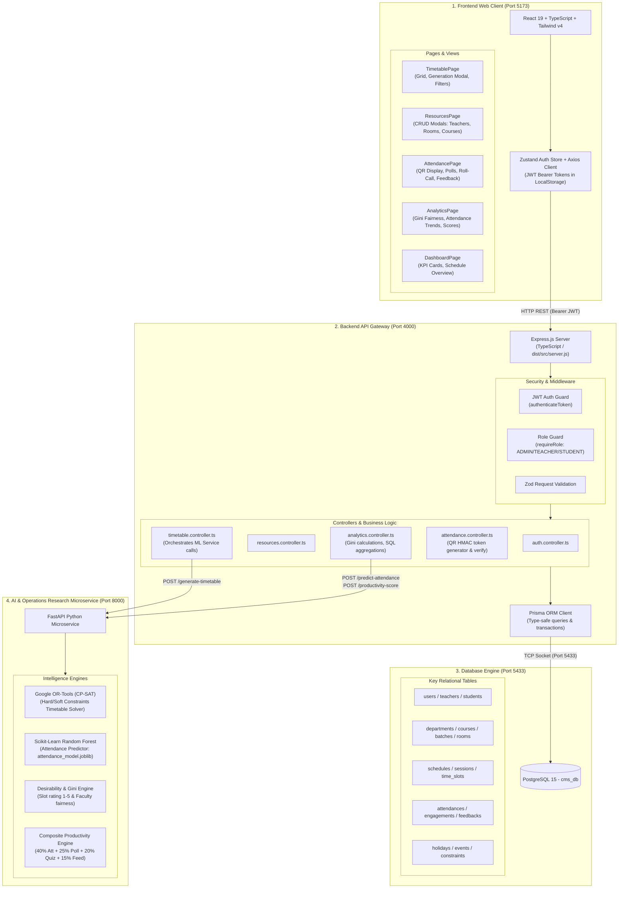
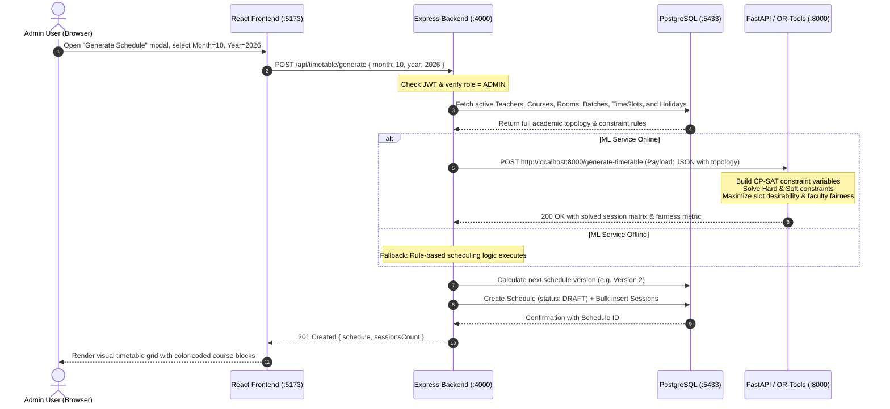
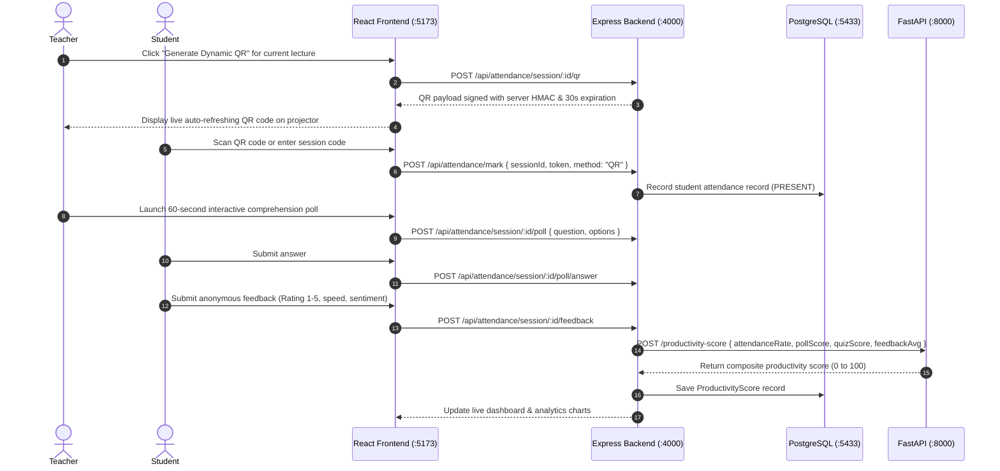

# College Scheduling & Productivity Intelligence System
## Phase 1 Documentation: System Architecture, Operations & Working Guide

This directory contains the complete technical architecture, operational manuals, data flow diagrams, and developer extension guides for the **College Scheduling & Productivity Intelligence System (CMS)**.

---

## Table of Contents

1. [System Architecture & Working Diagrams](#1-system-architecture--working-diagrams)
   - [Full-Stack Component Diagram](#full-stack-component-diagram)
   - [AI Timetable Generation Workflow (Sequence)](#ai-timetable-generation-workflow-sequence)
   - [QR Attendance & Lecture Productivity Workflow](#qr-attendance--lecture-productivity-workflow)
2. [How to Utilize the Frontend (React + Vite)](#2-how-to-utilize-the-frontend-react--vite)
   - [Execution & Tech Stack](#execution--tech-stack)
   - [Pages & Operational Capabilities](#pages--operational-capabilities)
   - [Demo User Credentials](#demo-user-credentials)
3. [How to Utilize the Database (PostgreSQL + Prisma)](#3-how-to-utilize-the-database-postgresql--prisma)
   - [Database Connection & Settings](#database-connection--settings)
   - [Prisma Studio (Visual GUI)](#prisma-studio-visual-gui)
   - [Database Migrations & Seeding](#database-migrations--seeding)
   - [Relational Data Model Summary](#relational-data-model-summary)
4. [How to Utilize the ML & Optimization Microservice](#4-how-to-utilize-the-ml--optimization-microservice)
   - [Architecture & Responsibilities](#architecture--responsibilities)
   - [How to Set Up & Start the ML Service](#how-to-set-up--start-the-ml-service)
   - [FastAPI Interactive Swagger Docs](#fastapi-interactive-swagger-docs)
5. [Developer Guide: How to Make Future Changes](#5-developer-guide-how-to-make-future-changes)
   - [A. Adding a Field to the Database](#a-adding-a-field-to-the-database)
   - [B. Adding a Custom Constraint to the Timetable Solver](#b-adding-a-custom-constraint-to-the-timetable-solver)
   - [C. Adding a New Screen or Route in the Frontend](#c-adding-a-new-screen-or-route-in-the-frontend)
   - [D. Adding a New Backend Endpoint](#d-adding-a-new-backend-endpoint)

---

## 1. System Architecture & Working Diagrams

The system is constructed as a three-tier decoupled architecture:
1. **Client**: Single-Page Web Application in React 19, TypeScript, and Tailwind CSS v4.
2. **Server**: RESTful API Gateway built with Node.js, Express, and Prisma ORM.
3. **Database**: PostgreSQL 15 relational storage (`cms_db`).
4. **Intelligence Microservice**: Python FastAPI service running Google OR-Tools CP-SAT and Scikit-Learn.

### Full-Stack Component Diagram



---

### AI Timetable Generation Workflow (Sequence)



---

### QR Attendance & Lecture Productivity Workflow



---

## 2. How to Utilize the Frontend (React + Vite)

### Execution & Tech Stack
- **Location**: `client/`
- **Port**: `http://localhost:5173`
- **Framework**: React 19, TypeScript, Vite
- **Styling**: Tailwind CSS v4 (configured in `client/src/index.css`)
- **State Management**: Zustand in `client/src/store/useAuthStore.ts`
- **HTTP Client**: Axios with automatic JWT injection in `client/src/api/client.ts`

### Pages & Operational Capabilities

1. **Timetable Dashboard (`/timetable`)**:
   - Filter by Batch, Department, or Teacher.
   - Switch between weekly and monthly grid representations.
   - **Admins**: Click the violet **"AI Generate"** button to open the generation modal, select month/year, and run the solver. Click **"Publish"** to activate the schedule for all campus members.

2. **Campus Resources (`/resources`) [Admin Only]**:
   - Tabbed view managing **Teachers**, **Courses**, **Rooms**, **Batches**, and **Holidays/Events**.
   - Each tab features a modal to create new records or delete existing ones directly through the API.

3. **Attendance & Live Engagement (`/attendance`)**:
   - **Teacher Mode**:
     - Dynamic HMAC QR Code generator with real-time countdown timer.
     - Interactive quick-poll module (enter question, options A/B/C/D, collect live answers).
     - Roster-based manual roll call toggle (Present, Late, Absent).
   - **Student Mode**:
     - Fast check-in submission.
     - Poll answering module.
     - 4-question anonymous lecture feedback form.

4. **Analytics & Productivity (`/analytics`)**:
   - **Gini Fairness Index**: Visual bar charts comparing faculty assignment desirability.
   - **Attendance Trends**: Multi-series line charts showing student attendance across time of day.
   - **Productivity Ranking**: Detailed table with color-coded composite productivity ratings.

### Demo User Credentials

| Role | Email | Password | Primary Functions |
|---|---|---|---|
| **Admin** | `admin@college.edu` | `AdminPass123!` | Resource CRUD, AI schedule generation, publishing |
| **Teacher** | `turing@college.edu` | `TeacherPass123!` | View assigned timetable, generate QR codes, launch polls |
| **Student** | `student1@college.edu` | `StudentPass123!` | View student schedule, QR check-in, submit feedback |

---

## 3. How to Utilize the Database (PostgreSQL + Prisma)

### Database Connection & Settings
- **PostgreSQL Port**: `5433` (configured to prevent port conflicts with standard PostgreSQL or MySQL instances).
- **Database Name**: `cms_db`
- **Connection URL**: `postgresql://postgres@127.0.0.1:5433/cms_db?schema=public`

### Prisma Studio (Visual GUI)
To browse, filter, inspect, and manually edit records in the database with a visual web interface:
```powershell
cd e:\xampp\htdocs\img\CMS\server
npx prisma studio --port 5555
```
Open **`http://localhost:5555`** in your browser.

### Database Migrations & Seeding
From the `server/` directory:
```powershell
# Apply changes to schema.prisma and create migration
npx prisma migrate dev --name <migration_name>

# Re-generate Prisma Client types
npx prisma generate

# Seed sample data (faculty, rooms, batches, demo users)
npx ts-node prisma/seed.ts
```

### Relational Data Model Summary
Located in `server/prisma/schema.prisma`:
- **Identity**: `User`, `Teacher`, `Student`, `Department`
- **Resources**: `Course`, `Room`, `Batch`, `TimeSlot`
- **Timetable**: `Schedule` (has many `Session` records with `status: DRAFT | PUBLISHED | ARCHIVED`)
- **Engagement**: `Attendance`, `Engagement` (polls/quizzes), `Feedback`
- **Analytics**: `ProductivityScore`, `Holiday`, `Event`, `Constraint`

---

## 4. How to Utilize the ML & Optimization Microservice

### Architecture & Responsibilities
Located in `ml-service/`, the Python service provides mathematical optimization and prediction:
- **`solver.py`**: Google OR-Tools CP-SAT constraint satisfaction engine for collision-free timetable generation.
- **`predictor.py`**: Scikit-Learn Random Forest model predicting attendance percentages based on slot, day, and subject.
- **`productivity.py`**: Composite lecture score calculations using the 4-signal formula:
  $$\text{Score} = (0.40 \times \text{Attendance}) + (0.25 \times \text{Poll}) + (0.20 \times \text{Quiz}) + (0.15 \times \text{Feedback})$$

### How to Set Up & Start the ML Service
Open a PowerShell terminal:
```powershell
cd e:\xampp\htdocs\img\CMS\ml-service

# 1. Create and activate a Python virtual environment
python -m venv venv
.\venv\Scripts\Activate.ps1

# 2. Install dependencies
pip install -r requirements.txt

# 3. Train the attendance model (generates attendance_model.joblib)
python train_attendance_model.py

# 4. Run the FastAPI development server
uvicorn main:app --host 0.0.0.0 --port 8000 --reload
```

### FastAPI Interactive Swagger Docs
Once the ML microservice is running, open **`http://localhost:8000/docs`** to test all endpoints:
- `POST /generate-timetable`: Takes JSON academic topology and returns solved slot assignments.
- `POST /predict-attendance`: Takes class context and returns predicted attendance rate.
- `POST /productivity-score`: Computes composite rating.
- `GET /health`: Healthcheck endpoint.

---

## 5. Developer Guide: How to Make Future Changes

### A. Adding a Field to the Database
1. Open `server/prisma/schema.prisma` and add your field:
   ```prisma
   model Teacher {
     // ...
     officeLocation String?
   }
   ```
2. Run migration: `npx prisma migrate dev --name add_office_location`
3. Update the controller in `server/src/controllers/resources.controller.ts` to receive and persist the new field.
4. Update the TypeScript interface and UI form in `client/src/pages/ResourcesPage.tsx`.

### B. Adding a Custom Constraint to the Timetable Solver
1. Open `ml-service/solver.py`.
2. Locate the CP-SAT solver setup in `TimetableSolver.solve()`.
3. Add your constraint using the CP-SAT API. For example, to avoid faculty having more than 3 consecutive periods:
   ```python
   # Max 3 consecutive sessions per teacher
   for t in teachers:
       for day in days:
           for s in range(len(slots) - 3):
               model.Add(sum(assignments[(t, day, s + i)] for i in range(4)) <= 3)
   ```

### C. Adding a New Screen or Route in the Frontend
1. Create `client/src/pages/MyNewPage.tsx`.
2. Add the route in `client/src/App.tsx`:
   ```tsx
   <Route path="/my-feature" element={<ProtectedRoute><MyNewPage /></ProtectedRoute>} />
   ```
3. Add a navigation link to `client/src/components/layout/Navbar.tsx`.

### D. Adding a New Backend Endpoint
1. Create route definition in `server/src/routes/new.routes.ts`.
2. Add logic in `server/src/controllers/new.controller.ts`.
3. Register the route in `server/src/server.ts`:
   ```typescript
   app.use('/api/my-feature', newRoutes);
   ```
4. Query the endpoint from the frontend using `client/src/api/client.ts`.
