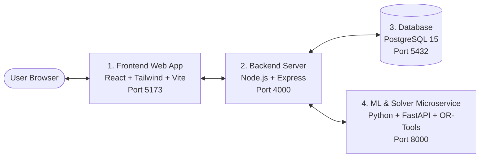

# Comprehensive User Guide: College Timetable & Lecture Productivity System

Welcome to the **College Scheduling & Productivity Intelligence System (CMS)** user guide. This document explains everything you need to know to understand, configure, operate, and succeed with this platform—even if you are not a developer.

---

## 1. What Is This System & What Problem Does It Solve?

In most colleges and universities, timetable scheduling is a manual, chaotic process done once a semester in Excel spreadsheets. This causes four persistent problems:

1. **The Monthly Holiday & Event Nightmare:**
   Semesters are not static. A class scheduled on Mondays loses multiple lectures to public holidays, cultural festivals, sports days, or exams. Usually, teachers scramble at the end of the semester to cram make-up classes on weekends.
   * **Our Solution:** A dynamic monthly schedule engine that starts with a base weekly pattern, scans the academic calendar for declared holidays or events, masks those dates automatically, and schedules make-up classes intelligently.

2. **The "Ghost Slot" Late-Afternoon Problem:**
   Every college has slots that students routinely skip—especially the first period (8:30 AM for commuters) and the final period of the day (3:45–4:45 PM). Often, the same teachers or junior faculty end up assigned to these late slots every week. As a result, their attendance records look terrible, students miss core lectures, and teachers feel cheated.
   * **Our Solution:** Mathematical fairness balancing and slot desirability scoring. The system rates every slot from 1 to 5. Our algorithm calculates a **Fairness Index (Gini coefficient)** and guarantees that undesirable slots are rotated and shared equally across all faculty members.

3. **Judging Teachers by Headcount Alone:**
   Normally, an administrator only looks at whether a teacher logged 16 contact hours. But were the students actually alert, engaged, and learning?
   * **Our Solution:** Multi-signal **Lecture Productivity Scoring**. Each lecture is evaluated on four balanced pillars: attendance percentage, live poll engagement, short exit comprehension quizzes, and anonymous student feedback.

4. **Predictive Attendance Optimization:**
   Instead of guessing when to schedule difficult courses, our **Machine Learning (AI)** model analyzes historical attendance data (by day, time, course, and teacher) to place high-priority courses in high-attendance time slots.

---

## 2. How the 4 Components Work Together

The system is built as four distinct pieces that communicate seamlessly:



1. **Frontend Web App (Client - Port 5173):** The visual interface you interact with in your web browser. Includes drag-and-drop timetable grids, interactive charts, attendance QR displays, and administrative control panels.
2. **Backend Server (Server - Port 4000):** The central brain and gatekeeper. Handles user logins, password security, permission checks, database queries, and passes scheduling tasks to the ML service.
3. **Database (PostgreSQL - Port 5432):** The permanent filing cabinet. Stores information about teachers, students, classrooms, courses, holidays, past attendance logs, and generated timetables.
4. **ML & Optimization Service (Python - Port 8000):** The specialized mathematical engine. Uses Google OR-Tools (CP-SAT) to solve complex puzzle-like scheduling rules in seconds, predicts student attendance using Random Forest machine learning, and calculates fairness scores.

---

## 3. What You Need on Your Computer (Prerequisites)

To run this project on your computer, ensure you have the following installed:

- **Node.js (Version 18 or higher):** Download from [nodejs.org](https://nodejs.org/). This runs the backend and frontend.
- **Python (Version 3.11):** Download from [python.org](https://www.python.org/). (Make sure to check *"Add Python to PATH"* during Windows installation).
- **PostgreSQL 15:** Download from [postgresql.org](https://www.postgresql.org/).
- **Docker Desktop (Optional, but easiest):** Download from [docker.com](https://www.docker.com/). If you have Docker, you don't need to manually configure Python, Node, or PostgreSQL!

> [!TIP]
> **Working in XAMPP?** If you have XAMPP installed on Windows (like in `e:\xampp\htdocs`), note that XAMPP comes with MySQL/Apache. This system uses **PostgreSQL**, which runs on Port `5432` without interfering with XAMPP's MySQL (Port `3306`). You can run both side by side without issues.

---

## 4. How to Start the System

### Option A: The One-Click Docker Method (Recommended)
If you have Docker Desktop installed, open your terminal (PowerShell or Command Prompt) and run:

```bash
# 1. Navigate to the project root
cd e:\xampp\htdocs\img\CMS

# 2. Copy the environment configuration
copy .env.example .env

# 3. Start everything with one command
docker-compose up --build
```
That's it! Docker will automatically install all dependencies, build the containers, configure PostgreSQL, run database migrations, load sample seed data, and launch all servers.

### Option B: The Manual Local Setup Method
If running directly on Windows without Docker:

#### 1. Start the Database
Ensure your PostgreSQL server is running on port `5432`. Create a database named `college_timetable`.

#### 2. Start the Backend Server
Open a terminal:
```powershell
cd e:\xampp\htdocs\img\CMS\server
npm install
npx prisma migrate dev --name init
npx prisma db seed
npm run dev
```
*The server will start on `http://localhost:4000`.*

#### 3. Start the Python ML Service
Open a second terminal:
```powershell
cd e:\xampp\htdocs\img\CMS\ml-service
python -m venv venv
.\venv\Scripts\Activate.ps1
pip install -r requirements.txt
python train_attendance_model.py
uvicorn main:app --host 0.0.0.0 --port 8000 --reload
```
*The ML service will start on `http://localhost:8000`.*

#### 4. Start the Frontend Web App
Open a third terminal:
```powershell
cd e:\xampp\htdocs\img\CMS\client
npm install
npm run dev
```
*Your browser will open at `http://localhost:5173`.*

---

## 5. Ready-to-Use Test Accounts

The seed script (`prisma/seed.ts`) populates sample accounts ready for testing:

| Role | Email | Password | What You Can Do |
| :--- | :--- | :--- | :--- |
| **Administrator** | `admin@college.edu` | `AdminPass123!` | Create courses, add teachers, generate & publish timetables, view institutional analytics |
| **Teacher** | `turing@college.edu` | `TeacherPass123!` | View personal schedule, launch attendance QR code, start in-class quiz |
| **Teacher** | `hopper@college.edu` | `TeacherPass123!` | View personal schedule, launch attendance QR code, view lecture feedback |
| **Student** | `student1@college.edu` | `StudentPass123!` | View batch schedule, scan QR check-in, submit end-of-lecture feedback |

---

## 6. Day-to-Day Operations Walkthrough

### Scenario 1: Setting Up a New Academic Month (Admin)
1. Log in as `admin@college.edu`.
2. Go to **Academic Calendar**:
   - Add any gazetted holidays falling in the upcoming month (e.g., *Oct 2: Gandhi Jayanti*, *Oct 24: Diwali*).
   - Add university events that block regular classes (e.g., *Oct 15–17: Annual Sports Meet*).
3. Go to **Timetable Management**:
   - Select the target Month (e.g., October) and Year (2026).
   - Click the **"Generate AI Timetable"** button.
   - Adjust preference sliders if desired (e.g., set *Teacher Fairness Weight* to high).
   - Click **Run Solver**.
4. In 5–15 seconds, the system generates an entire collision-free monthly schedule!
5. **Review the Draft:** Inspect the interactive grid.
   - Want to manually swap a class? Simply drag the card to another open slot. If there's a collision (e.g., the teacher is already booked), the system will alert you and prevent the mistake.
6. Click **"Publish Schedule"**. The timetable is now live for all teachers and students.

### Scenario 2: Conducting a Lecture & Tracking Productivity (Teacher)
1. Log in as `turing@college.edu`.
2. On your dashboard, click **"Start Today's Lecture"**.
3. **Take Attendance via Dynamic QR:**
   - Click **"Display Attendance QR"** and project it on the classroom screen.
   - The QR code dynamically refreshes every 15 seconds so students cannot photograph it and send it to friends at home.
   - Alternatively, open the **Manual Roll Call** tab and check off students manually.
4. **Boost Engagement:**
   - Halfway through the lecture, click **"Launch Quick Poll"**.
   - Type a single question: *"Which data structure did we just discuss for O(1) lookups?"*
   - Students tap their answer on their phones in 30 seconds.
5. **End Lecture:**
   - As students leave, their mobile app displays a 10-second exit feedback screen (1 to 5 stars + optional tags like *"Clear pacing"* or *"Too fast"*).
6. The system automatically computes your **Productivity Score** (e.g., `88/100`) and displays the breakdown on your analytics dashboard.

### Scenario 3: Checking In & Giving Feedback (Student)
1. Log in as `student1@college.edu` on a phone or laptop.
2. View your daily timetable, classroom room numbers, and holiday notices.
3. During class, tap **"Scan Attendance"** to check in via camera.
4. Answer the live teacher poll.
5. Rate the lecture 5 stars and submit honest, constructive feedback.

---

## 7. How the AI Optimization Really Works (In Plain English)

You don't need a math degree to understand what Google OR-Tools CP-SAT is doing:

Think of scheduling as solving a giant **Sudoku puzzle**:
- **Rules that CAN NEVER be broken (Hard Constraints):**
  - A teacher cannot be in two classrooms at the same time.
  - Two classes cannot be in Room 101 at the same time.
  - A student batch cannot attend Physics and Chemistry at the same hour.
  - A class of 60 students cannot be scheduled in a room with only 30 desks.
  - Nobody has class during the 12:45–1:45 PM lunch break.
  - Teachers cannot teach more than 3 lectures in a row without a break.
  - No classes are scheduled on holidays.

- **Goals the computer tries to MAXIMIZE (Soft Constraints):**
  - **Teacher Fairness:** Minimize the gap between the teacher with the most 4:00 PM slots and the teacher with the fewest. (Everyone shares the load equally).
  - **Attendance Prediction:** Place core subjects when students are historically most awake and present.
  - **Teacher Preference:** Schedule teachers on days and times they requested when possible.
  - **Compact Schedules:** Avoid awkward 2-hour empty gaps in students' daily schedules.

The solver tests thousands of combinations per second, eliminating invalid ones until it finds the mathematically optimal schedule that scores highest on all goals.

---

## 8. Troubleshooting & Common Questions

#### Q1: "I clicked Generate Timetable, but it says Solver Infeasible."
* **What it means:** The mathematical rules you gave the system contradict each other. For example: You require 40 hours of classes, but there are only 30 available classroom slots in the week; or a teacher is required to teach 25 hours, but their maximum weekly load is set to 15.
* **How to fix:** Go to **Admin > Resources** and check:
  1. Do you have enough classrooms for all concurrent batches?
  2. Are teacher `maxWeeklyLoad` values higher than their total course hours?
  3. Ensure lab courses have appropriate Lab rooms assigned.

#### Q2: "Can I export the timetable to print or post on notice boards?"
* **Yes!** On the Timetable page, click **Export PDF** or **Export CSV** to download ready-to-print schedules for each batch or teacher.

#### Q3: "What if a teacher is sick and we need an emergency substitute?"
* An administrator can open the live Timetable, click on the specific session, select **Edit Session**, change the instructor to another qualified faculty member, and save. The change reflects immediately on student phones.

#### Q4: "Where are the technical specifications if our IT team wants to customize the code?"
* Check the `/documentation` directory:
  - [ARCHITECTURE.md](file:///e:/xampp/htdocs/img/CMS/documentation/ARCHITECTURE.md): System components & data flow.
  - [DATABASE.md](file:///e:/xampp/htdocs/img/CMS/documentation/DATABASE.md): Complete Prisma schema & ERD.
  - [API.md](file:///e:/xampp/htdocs/img/CMS/documentation/API.md): Full REST API endpoints.
  - [ML_SERVICE.md](file:///e:/xampp/htdocs/img/CMS/documentation/ML_SERVICE.md): Deep dive into OR-Tools, Random Forest, & fairness mathematics.
  - [SETUP.md](file:///e:/xampp/htdocs/img/CMS/documentation/SETUP.md): Technical setup instructions & environment variables.
  - [AI_DEV_GUIDE.md](file:///e:/xampp/htdocs/img/CMS/documentation/AI_DEV_GUIDE.md): Step-by-step master plan for AI coding agents.
